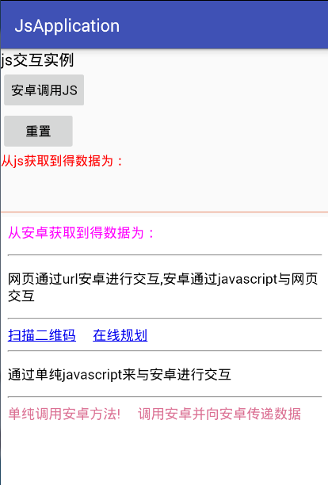
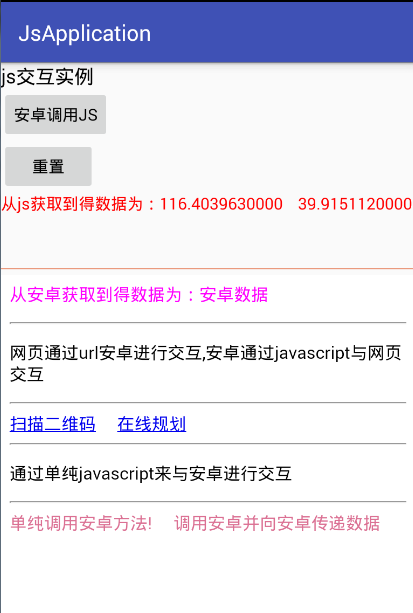

# JsAndroid · JS ↔ Android 交互实验室

Js 与原生安卓进行交互案例

**历史预览（2017 UI，仅作效果参考；当前界面以 App 内 `demo.html` 为准）：**

   

面向 Hybrid / WebView 场景的**可运行示例集**：AndroidX + AGP 8.x，启动加载本地 [`assets/demo.html`](app/src/main/assets/demo.html)。

> 适合搞清 H5 ↔ 原生通信机制与常见坑。不是金融业务壳。

## 下载 APK

- **最新 Release：** https://github.com/cheng2016/JsAndroid/releases/latest  
- 全部版本：https://github.com/cheng2016/JsAndroid/releases  

> APK 仅通过 GitHub Releases 分发，不入库。包为 debug 签名，仅供演示。

## 推荐学习路径（先点这 5 个）

1. **Toast / 传 JSON** — 理解 `@JavascriptInterface`
2. **Promise 异步** — 理解 Native `evaluateJavascript` 回调
3. **alert / confirm** — 理解 `WebChromeClient` 拦截（不依赖桥）
4. **jsbridge:// Scheme** — 理解 `shouldOverrideUrlLoading`
5. **secureCall 鉴权** — 理解生产 Hybrid 的白名单 + token 门闩

然后再玩：扫码权限、选图 Base64、定位、Cookie、文件选择。

## 60 秒上手

**方式 A：直接安装** — 从 [Releases](https://github.com/cheng2016/JsAndroid/releases/latest) 下载 APK。

**方式 B：源码运行**

```bash
./gradlew assembleDebug
```

Android Studio 打开工程 → Run。应看到「JsAndroid 交互实验室」。

| 顶部按钮 | 作用 |
|----------|------|
| Native→JS | Native 主动推送 JSON |
| 重置 | 清空状态与日志 |
| 遗留壳 | 打开本地遗留说明页（不再跳失效远程站） |

远程调试：`chrome://inspect`。CI：push 到 `master` 会跑 [Android CI](.github/workflows/android-ci.yml)。

## 经典场景覆盖清单

| # | 场景 | 机制 |
|---|------|------|
| 1 | JS→Native 同步 / 有返回值 | `@JavascriptInterface` |
| 2 | JSON 传参 | `JSONObject` |
| 3 | 异步回调 / Promise | `evaluateJavascript` |
| 4 | Native Confirm/Prompt | 桥 + 回调名 |
| 5 | Native→JS 主动推送 | `evaluateJavascript` |
| 6 | alert/confirm/prompt/console | `WebChromeClient` |
| 7 | 加载进度 / 下载监听 | progress + `DownloadListener` |
| 8 | URL Scheme / tel / mailto | `shouldOverrideUrlLoading` |
| 9 | 剪贴板 / 分享 / 拨号短信邮件 | Intent |
| 10 | 选文件（桥 + input） | Activity Result + `onShowFileChooser` |
| 11 | 相机权限 + 扫码 | CAMERA + ZXing（旧库，演示权限流） |
| 12 | 页面 goBack/reload/close | WebView / Activity |
| 13 | localStorage | `domStorageEnabled` |
| 14 | Cookie 读写 | `CookieManager` |
| 15 | 定位 | 运行时权限 + lastKnown |
| 16 | 相册图 → Base64 | 压缩后回传 |
| 17 | 白名单 + Token 鉴权 | `secureCall` / `isTrustedPage` |

桥对象：`window.NativeBridge` → [`NativeBridge.java`](app/src/main/java/com/example/cheng/js/NativeBridge.java)

## API 速查（增量）

```js
// Cookie
NativeBridge.setCookie('https://demo.jsandroid.local/', 'sid=abc; Path=/')
NativeBridge.getCookie('https://demo.jsandroid.local/')

// 定位 / 图片
window.__locCb = (r) => console.log(r)
NativeBridge.getLocation('__locCb')
window.__imgCb = (dataUrl) => { /*  */ }
NativeBridge.pickImageBase64('__imgCb')

// 鉴权（token = demo-token-jsandroid，且页面须受信）
NativeBridge.secureCall('demo-token-jsandroid', 'pay', '{"amount":1}')
NativeBridge.isTrustedPage()
```

更多 API 见 App 内分区按钮或源码注释。

## 常见坑

1. **缺 `@JavascriptInterface`**：API 17+ 方法对 JS 不可见。
2. **子线程改 UI**：桥方法不在主线程，碰 View 要 `runOnUiThread`。
3. **字符串未转义**：`evaluateJavascript('cb("a"b")')` 会炸；用 `jsonStringLiteral`。
4. **Scheme 大小写**：`startsWith` 区分大小写，统一小写协议。
5. **`<input type=file>` 卡住**：必须实现 `onShowFileChooser` 并在结果里 `onReceiveValue`。
6. **Release 混淆把桥方法砍掉**：见 [`proguard-rules.pro`](app/proguard-rules.pro)，开启 minify 时务必 keep。
7. **file:// Cookie 限制**：部分机型对 file 源 Cookie 不友好，演示用 https host 字符串写入。
8. **定位为空**：`getLastKnownLocation` 可能 null，需系统曾产生过定位。

## Native 推荐写法

```java
webView.getSettings().setJavaScriptEnabled(true);
webView.getSettings().setDomStorageEnabled(true);
webView.addJavascriptInterface(new NativeBridge(host), "NativeBridge");
webView.evaluateJavascript("onNativeMessage({ok:true})", null); // 不要用 loadUrl("javascript:")
```

选图 / 扫码已改用 **Activity Result API**（不再依赖过时的 `startActivityForResult` 主路径）。

## 工程结构

```
app/src/main/
├── assets/demo.html              # 主实验室
├── assets/legacy_shell.html      # 遗留壳说明页
├── java/.../MainActivity.java
├── java/.../NativeBridge.java
└── ...
.github/workflows/android-ci.yml  # assembleDebug
app/proguard-rules.pro            # JS Bridge keep
```

## 环境

- JDK 17+、Android SDK 34
- `local.properties` 的 `sdk.dir` 勿提交

## 刻意没做

- 完整金融 `BaseInterface` / `TouguInterface`
- 第三方 JsBridge 库（便于看清原生机制）
- Kotlin / Compose
- 持续定位 / ML Kit 扫码（ZXing 仅演示权限与回传）

生产环境请再补：域名白名单强制校验、Bridge 鉴权、证书校验、敏感 API 审计。
